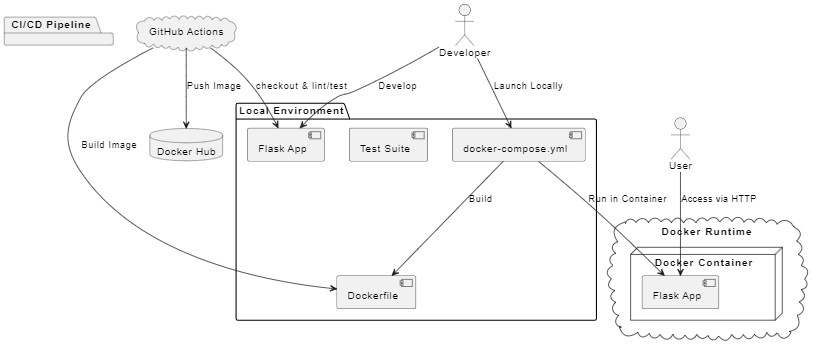

# LOG430
Nom: Lawrence Liang

## Description
Ceci est un API utilisant Python Flask. Python Flask est un quadriciel permettant de facilement mettre en place des URL et faire un backend rapide. De plus, il exite beaucoup d'aide, et est compatible avec le système de test, soit PyTest.

De plus, afin de conteneuriser l'application, j'utilise docker qui est très facile et straight forward. 

Finalement, pour le linting, j'ai choisis PyLint qui a beaucoup de support et facile à troubleshoot.

## L'architecture

## Instruction d'installation et execution

### Cloner le projet
`git clone https://github.com/LawrenceLiang02/LOG430.git`

### Installer un .venv
[Suivre ce lien](https://packaging.python.org/en/latest/guides/installing-using-pip-and-virtual-environments/) pour installer un .venv.

### Installer les librairies:
La commande dans le terminal est la suivante: `pip install -r requirements.txt`

### Build docker and run
La commande dans le terminal est: `docker-compose up --build`

### Execution de l'application

Terminal: `python app.py`

### Execution des tests

Terminal: `pytest`

## CI/CD Pipeline:

Le pipeline CI/CD vérifie d'abord le système de lint, spécifiquement PyLint. Ensuite, il exécute les tests dans `test_app.py`, puis il buildera le docker-compose. 

## Mettre à jour les requirements.txt:

`pip freeze > requirements.txt`