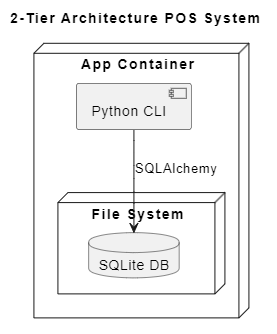

# LOG430 - Étape 1
```
Nom: Lawrence Liang
Groupe: 02
Session: Été 2025
```

## Description
Ceci est une application console qui gère l'inventaire et les ventes d'une compagnie. 

Dans ce projet, j'applique:
- Un workflow CI/CD retrouvé dans la page "Actions" de GitHub
- Un conteneur Docker qui est publié sur DockerHub
- Une application CRUD qui gère les ventes et les produits
- Des tests unitaires automatisés sur chaque branche à chaque commit.
- Automatiser l'utilisation d'un Linter pour vérifier mon code source

Les piles technologiques utilisé sont:
- Python pour la logique
- SQLAlchemy en tant qu'ORM
- SQLite pour la base de donnée

Ce projet a une architecture 2-tier.

## L'architecture

Ceci est un système à 2 couches puisque la logique de la couche de présentation et la couche de donnée sont séparées. 

À travers le CLI, on communique avec la base de données SQLite à travers le système de fichier.




## Analyse des besoins

Fonctionnels:
- Le système doit permettre l'ajout d'un produit
- Le système doit permettre la consultation de l'état du stock
- Le système doit permettre d'enregistrer une vente
- Le système doit permettre l'annulation d'une vente
- Le système doit permettre la recherche d'un produit

Non fonctionnels
- Le système doit être dans une architecture à 2 couches
- Le système doit être pouvoir de fonctionner entièrement localement (pas de serveur HTTP/REST)
- Le système doit utiliser un ORM tel que SQLAlchemy
- Le système doit assurer la cohérence des données lors des ventes et annulations.
- Le système doit avoir une couverture de bases par des tests unitaires avec PyTest.
- Le système doit pouvoir tourner dans un contenur Docker, avec une base SQLite.

## Justification des décisions d'architecture.

| # | Titre | Lien |
| - | - | - |
| 1 | Choix de la plateforme | [ADR 1](docs/ADR/ADR1.md)|
| 2 | Séparation des responsabilités entre présentation, logique et persistance | [ADR 2](docs/ADR/ADR2.md)|


## Choix technologique

- **Python** : langage simple et expressif, très utilisé pour des projets rapides.
- **SQLAlchemy** : ORM mature et compatible avec plusieurs SGBD (SQLite, PostgreSQL, etc.), facilite la persistance tout en gardant l’indépendance du SGBD.
- **SQLite** : SGBD léger, sans configuration serveur, idéal pour une application locale.

## Instruction d'installation et d'execution

### Cloner le projet
Git bash: `git clone https://github.com/LawrenceLiang02/LOG430_ETAPE1.git`

### Installer un environnement virtuel
[Suivre les instructions dans ce lien](https://packaging.python.org/en/latest/guides/installing-using-pip-and-virtual-environments/) pour installer un .venv.

### Installer les librairies
Terminal: `pip install -r requirements.txt`

### Build et executer avec Docker
`docker-compose build`
`docker-compose run --rm app`

### Executer l'application localement

Terminal: `python app.py`

### Executer les tests unitaires manuellement

Terminal: `pytest`

## CI/CD Pipeline:

Le pipeline CI/CD vérifie d'abord le système de lint, spécifiquement PyLint. Ensuite, il exécute les tests dans `test_app.py`, puis il buildera le docker-compose. 

## Mettre à jour les requirements.txt:

`pip freeze > requirements.txt`