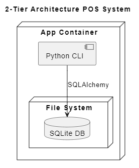
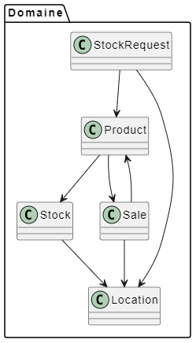
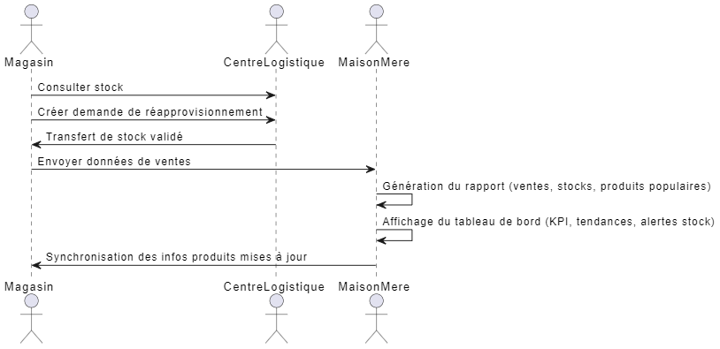
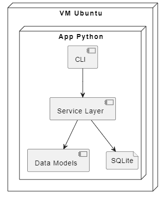
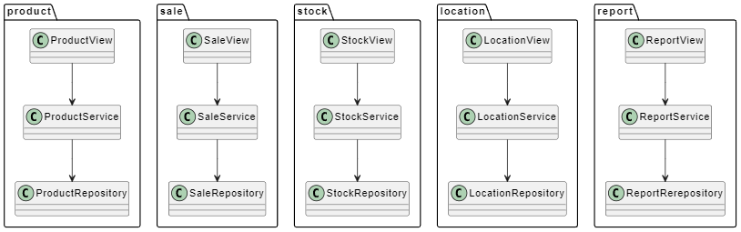
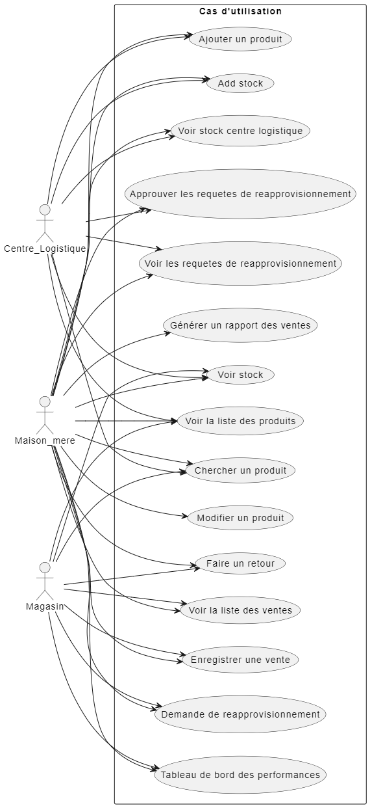

# LOG430 - Étape 1
```
Nom: Lawrence Liang
Groupe: 02
Session: Été 2025
```

## Description
Ceci est une application console qui gère l'inventaire et les ventes d'une compagnie. 

Dans ce projet, j'applique:
- Un workflow CI/CD retrouvé dans la page "Actions" de GitHub
- Un conteneur Docker qui est publié sur DockerHub
- Une application CRUD qui gère les ventes et les produits
- Des tests unitaires automatisés sur chaque branche à chaque commit.
- Automatiser l'utilisation d'un Linter pour vérifier mon code source

Les piles technologiques utilisé sont:
- Python pour la logique
- SQLAlchemy en tant qu'ORM
- SQLite pour la base de donnée

## L'architecture

### Laboratoire 1:
Ceci est un système à 2 couches puisque la logique de la couche de présentation et la couche de donnée sont séparées. 

À travers le CLI, on communique avec la base de données SQLite à travers le système de fichier.



### Laboratoire 2:
L'architecture du logiciel a évolué dans un architecture inspiré des domaines du DDD. Ce qui veut dire, c'est modularisé suivant le patron de MVC. Le folder `présentation_layer` contient les **vues**, le `service_layer` contient les **controlleurs**, et le `data_class` contient les **modèles**. Il y a des modules pour le stock, les produits, les ventes, les lieux, et la génération des rapports.

### Laboratoire 3:
Le système intègre une couche API permettant de créer des end-points pour l'extérieur. Il utilise l'authentification avec des tokens JWT.

## Analyse des besoins

Fonctionnels:
- Le système doit permettre l'ajout d'un produit
- Le système doit permettre la consultation de l'état du stock
- Le système doit permettre d'enregistrer une vente
- Le système doit permettre l'annulation d'une vente
- Le système doit permettre la recherche d'un produit
- Le système doit être en mesure de générer un rapport CSV contenant les ventes par magasin, produits les plus vendus, et niveau de stock acutels.
- Le système doit permettre la consultation de niveau de stock du centre logistique par un magasin.
- Le système doit permettre à une personne du maison mère de visualiser les performances des magasins tel que les alertes de rupture de stock ou de surstock, les tendances hebdomadaire et les ventes par magasin.
- Le système doit permettre la modification des produits uniquement par la maison mère.
- Le système doit permettre au centre logistique d'approuver un réapprovisionnement.
- Le système doit permettre à un magasin de faire une demande de réapprovisionnement

Non fonctionnels
- Le système doit être dans une architecture à 2 couches
- Le système doit être pouvoir de fonctionner entièrement localement (pas de serveur HTTP/REST)
- Le système doit utiliser un ORM tel que SQLAlchemy
- Le système doit assurer la cohérence des données lors des ventes et annulations.
- Le système doit avoir une couverture de bases par des tests unitaires avec PyTest.
- Le système doit pouvoir tourner dans un contenur Docker, avec une base SQLite.
- Le code doit être organisé par domaines (DDD inspiré) pour permettre l'évolutivité.
- Le système doit avoir des tests unitaires et tests d'intégration.
- Le système doit être contaeneurisé via Docker Compose.

## Justification des décisions d'architecture. (ADR)

| # | Titre | Lien |
| - | - | - |
| 1 | Choix de la plateforme (labo 1) | [ADR 1](docs/ADR/ADR1.md)|
| 2 | Séparation des responsabilités entre présentation, logique et persistance (labo 1) | [ADR 2](docs/ADR/ADR2.md)|
| 3 | Choix d’une architecture modulaire inspirée de DDD (labo 2) | [ADR 3](docs/ADR/ADR3.md) |
| 4 | Conteneurisation avec Docker Compose pour la simulation multi-sites (labo 2) | [ADR 4](docs/ADR/ADR4.md) |

## Choix technologique

- **Python** : langage simple et expressif, très utilisé pour des projets rapides.
- **Flask** : Framework pour les API, très facile et parfait pour le context du projet.
- **SQLAlchemy** : ORM mature et compatible avec plusieurs SGBD (SQLite, PostgreSQL, etc.), facilite la persistance tout en gardant l’indépendance du SGBD.
- **SQLite** : SGBD léger, sans configuration serveur, idéal pour une application locale.

## Accès à la documentation Swagger

Une fois que le projet est en exécution (voir en bas pour executer), va à ce URL:

`http://127.0.0.1:5000/api/docs`

Cette documentation contient:
- Description des endpoints
- Exemples de requetes/reponses
- Liste de tout les endpoints

## Authentification

L'authentification est fait avec des jetons JWT, spécifiquement de type Bearer.

Une fois que vous vous etes authentifiés à `http://127.0.0.1:5000/auth/login` avec:

```
{
  "username": "admin",
  "password": "adminpass"
}
```

Vous aurez un token qui expire après 15 minutes.

Pour chaque requetes, ajoutez un Bearer header dans l'authentification avec le token généré.

## Diagrammes

### Vue Logique



### Vue des processus



### Vue de deploiement



### Vue d'implémentation



### Vue de cas d'utilisation



## Instruction d'installation et d'execution pour le developpement

### Cloner le projet
Git bash: `git clone https://github.com/LawrenceLiang02/LOG430_ETAPE1.git`

### Installer un environnement virtuel
[Suivre les instructions dans ce lien](https://packaging.python.org/en/latest/guides/installing-using-pip-and-virtual-environments/) pour installer un .venv.

### Installer les librairies
Terminal: `pip install -r requirements.txt`

### Build et executer avec Docker
`docker-compose build`
`docker-compose up`

### Executer l'app

Terminal: `python app.py`

### Executer les tests unitaires manuellement

Terminal: `pytest`

## Instruction pour l'environnement de production

Dans la machine virtuelle, voici des commandes à utiliser.

### Télécharger la plus nouvelle version sur docker hub

`docker pull liangtzai/mon-api-flask:latest`

### Assurez vous d'avoir un `docker-compose.yml`

Dans ce fichier docker-compose.yml, vous pouvez créer autant d'instance de magasin que vous voulez. Voici un example.

```
version: '3.8'

services:
  maison_mere:
    image: liangtzai/mon-api-flask:latest
    stdin_open: true
    tty: true
    environment:
      - ROLE=Maison mère
      - LOCATION=Maison mère
    volumes:
      - shared_db:/app/data

  centre_logistique:
    image: liangtzai/mon-api-flask:latest
    stdin_open: true
    tty: true
    environment:
      - ROLE=Centre Logistique
      - LOCATION=Centre Logistique
    volumes:
      - shared_db:/app/data

  magasin1:
    image: liangtzai/mon-api-flask:latest
    stdin_open: true
    tty: true
    environment:
      - ROLE=Magasin
      - LOCATION=Magasin 1
    volumes:
      - shared_db:/app/data

volumes:
  shared_db:

```

### Commandes docker utiles:
Voir les images: `docker images`
Voir les conteneurs: `docker ps`

### Commande pour run le docker compose
`docker compose up`

### Commande pour connecter au CLI d'un magasin spécfique:
1. Trouver l'ID du conteneur que tu cherche avec `docker ps`
2. Connecter via la commande "attach": `docker attach <container_id>`

## CI/CD Pipeline:

Le pipeline CI/CD vérifie d'abord le système de lint, spécifiquement PyLint. Ensuite, il exécute les tests dans `test_app.py`, puis il buildera le docker-compose et soumettrera l'image sur docker hub.

## Mettre à jour les requirements.txt:

`pip freeze > requirements.txt`

## Test de charge avec k6

`k6 run {nom-du-fichier}`

