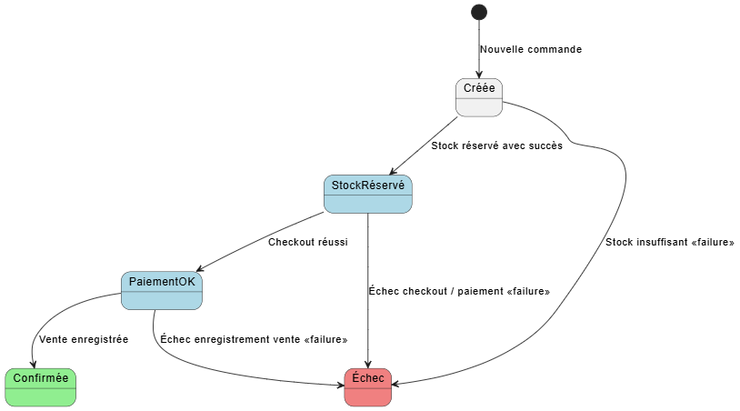

# LOG430 - Étape 2
```
Nom: Lawrence Liang
Groupe: 02
Session: Été 2025
Lien GitHub: https://github.com/LawrenceLiang02/LOG430_ETAPE1
```

## Description
Ceci est une application console qui gère l'inventaire et les ventes d'une compagnie. 

Dans ce projet, j'applique:
- Un workflow CI/CD retrouvé dans la page "Actions" de GitHub
- Un conteneur Docker qui est publié sur DockerHub
- Une application CRUD qui gère les ventes, les produits, le stock, le chariot, les locations, et les utilisateurs
- Des tests unitaires automatisés sur chaque branche à chaque commit.
- Automatiser l'utilisation d'un Linter pour vérifier mon code source

Les piles technologiques utilisé sont:
- Python pour la logique
- SQLAlchemy en tant qu'ORM
- SQLite pour la base de donnée
- KrakenD comme API Gateway
- Prometheus pour obtenir les metrics du système
- NGINX pour load balancing
- Redis pour caching

## Architecture Événementielle (Lab 7)

Le scénario métier choisi est celui d’un panier e-commerce, un processus représentatif et pertinent pour une architecture événementielle. 

Les étapes sont:
-	Ajout d’un article au panier
-	Paiement
-	Confirmation ou annulation

### Bus de message
Redis Stream

### Producteurs d'événements:
- cart_service lorsqu'il y a un post
- sale_service lorsqu'il y a une vente

### Abonnées aux événements (nouveaux services)
Notification Service (localhost:8007):
- get: /api/notifications/
- post: /api/notifications/

Audit Service (localhost:8008):
- get: /api/audit/logs

### Event Store:
Base de donnée SQLite, écriture et lecture dans audit service.

### CQRS: 

Command: cart_service (add / checkout), sale_service (record)

Query: Read Model alimenté par les événements comme l'état du panier

## Saga Orchestrateur (Lab 6)

Le scénario choisit est le suivant:

1. Vérification de Stock
2. Réservation de Stock
3. Paiement
4. Confirmation ou annulation de stock

Les status sont persistées dans une base de donnée SQLite, et chaque transition est sauvegardé dans les logs.

Voici le diagramme d'état:



### Cas de succès

Une fois connecté (logged in), tu peux executer le saga orchestré avec le lien suivant:

```http://localhost:8006/api/saga/start```

Il faut attacher le Bearing token ainsi que ce body:

```json
{
  "user": "John",
  "cart": [
    {
      "location": "Magasin 1",
      "product_id": 1,
      "quantity": 1
    }
  ]
}
```

Le résultat attendu est celui-ci:

```json
{
    "message": "Commande confirmée",
    "saga_id": 1
}
```

### Cas d'échec

#### Stock insuffisant

Dans le cas de stock insuffisant, voici le JSON à soumettre:

```json
{
  "user": "John",
  "cart": [
    {
      "location": "Magasin 1",
      "product_id": 2,
      "quantity": 1
    }
  ]
}
```

Voici la réponse attendu:

```json
{
    "message": "Stock insuffisant",
    "saga_id": 6,
    "error": "{\n    \"message\": \"Stock insuffisant (0 disponibles).\"\n}\n"
}
```


#### Erreur de vente

Dans le cas d'une erreur de vente, soit le service de vente est offline, voici le restultat attendu:

```json
{
    "message": "Erreur vente",
    "saga_id": 8,
}
```

#### Erreur de paiement:

Dans le cas d'une erreur de paiement:

```json
{
    "message": "Échec de la commande (checkout)",
    "saga_id": 9,
}
```


## L'architecture

### Laboratoire 5:

Ceci a adopté maintenant une architecture de microservices. Les services comprennent:
- un service d'authentification qui utilise un token JWT et contrôle la création d'utilisateur
- un service de stock pour controller l'inventaire
- un service de produit pour créer des produits qui peuvent être stocké
- un service pour gerer les locations (lieux)
- un service pour gerer le chariot et la selection d'un utilisateur
- un service pour gerer les ventes

Chaque microservice respectent l'architecture de trois couches.


## Analyse des besoins

Fonctionnels:
- Le système doit permettre l'ajout d'un produit
- Le système doit permettre la consultation de l'état du stock
- Le système doit permettre d'enregistrer une vente
- Le système doit permettre l'annulation d'une vente
- Le système doit permettre la recherche d'un produit
- Le système doit être en mesure de générer un rapport CSV contenant les ventes par magasin, produits les plus vendus, et niveau de stock acutels.
- Le système doit permettre la consultation de niveau de stock du centre logistique par un magasin.
- Le système doit permettre à une personne du maison mère de visualiser les performances des magasins tel que les alertes de rupture de stock ou de surstock, les tendances hebdomadaire et les ventes par magasin.
- Le système doit permettre la modification des produits uniquement par la maison mère.
- Le système doit permettre au centre logistique d'approuver un réapprovisionnement.
- Le système doit permettre à un magasin de faire une demande de réapprovisionnement

Non fonctionnels
- Le système doit être dans une architecture à 2 couches
- Le système doit être pouvoir de fonctionner entièrement localement (pas de serveur HTTP/REST)
- Le système doit utiliser un ORM tel que SQLAlchemy
- Le système doit assurer la cohérence des données lors des ventes et annulations.
- Le système doit avoir une couverture de bases par des tests unitaires avec PyTest.
- Le système doit pouvoir tourner dans un contenur Docker, avec une base SQLite.
- Le code doit être organisé par domaines (DDD inspiré) pour permettre l'évolutivité.
- Le système doit avoir des tests unitaires et tests d'intégration.
- Le système doit être contaeneurisé via Docker Compose.

## Justification des décisions d'architecture. (ADR)

| # | Titre | Lien |
| - | - | - |
| 1 | Choix de la plateforme (labo 1) | [ADR 1](docs/ADR/ADR1.md)|
| 2 | Séparation des responsabilités entre présentation, logique et persistance (labo 1) | [ADR 2](docs/ADR/ADR2.md)|
| 3 | Choix d’une architecture modulaire inspirée de DDD (labo 2) | [ADR 3](docs/ADR/ADR3.md) |
| 4 | Conteneurisation avec Docker Compose pour la simulation multi-sites (labo 2) | [ADR 4](docs/ADR/ADR4.md) |
| 5 | Choix de la passerelle API (KrakenD) (labo 5) | [ADR 5](docs/ADR/ADR5.md) |
| 6 | Choix du reverse proxy (NGINX) (labo 4) | [ADR 6](docs/ADR/ADR6.md) |
| 7 | Choix du système de cache (Redis) (labo 4) | [ADR 7](docs/ADR/ADR7.md) |
| 8 | Choix d’une Saga Orchestrée vs Saga Chorégraphiée (labo 6) | [ADR 8](docs/ADR/ADR8.md) |
| 9 | Persistance de la machine d’état avec SQLite (labo 6) | [ADR 9](docs/ADR/ADR9.md) |

## Choix technologique

- **Python** : langage simple et expressif, très utilisé pour des projets rapides.
- **Flask** : Framework pour les API, très facile et parfait pour le context du projet.
- **SQLAlchemy** : ORM mature et compatible avec plusieurs SGBD (SQLite, PostgreSQL, etc.), facilite la persistance tout en gardant l’indépendance du SGBD.
- **SQLite** : SGBD léger, sans configuration serveur, idéal pour une application locale.
- **KrakenD** : API Gateway hautes performances permettant d’agréger plusieurs microservices sous une seule interface. Il facilite la gestion des routes, la transformation des requêtes/réponses, la validation, et l’authentification. Idéal pour centraliser les appels à l’API et limiter le couplage entre frontend et services internes.

- **NGINX** : Serveur web et proxy inverse très performant. Il agit comme point d’entrée initial pour recevoir les requêtes HTTP(S), gérer le SSL/TLS, et répartir la charge vers plusieurs instances de KrakenD ou d’autres services. Il améliore la sécurité et la résilience globale du système.

- **Redis** : Système de cache en mémoire très rapide. Utilisé pour stocker temporairement les tokens d’authentification (JWT) ou d’autres données partagées entre microservices, afin de réduire les appels aux bases de données et d'améliorer la performance globale du système.

## Accès à la documentation Swagger

Une fois que le projet est en exécution (voir en bas pour executer), va à ce URL:

`http://localhost:{port}/api/docs`

Cette documentation contient:
- Description des endpoints
- Exemples de requetes/reponses
- Liste de tout les endpoints

Voici les ports pour chaque service:
- Krakend API Gateway: 8081
- Auth: 8000
- Location: 8001
- Product: 8002
- Stock: 8003
- Sale: 8004
- Cart: 8005
- Saga: 8006

## Authentification

L'authentification est fait avec des jetons JWT, spécifiquement de type Bearer.

Une fois que vous vous etes authentifiés à `http://localhost:8080/auth/login` avec:

```
{
  "username": "admin",
  "password": "admin"
}
```

Vous aurez un token qui expire après 15 minutes.

Pour chaque requetes, ajoutez un Bearer header dans l'authentification avec le token généré.

## Diagrammes

### Vue Logique


### Vue des processus


### Vue de deploiement


### Vue d'implémentation


### Vue de cas d'utilisation


## Instruction d'installation et d'execution pour le developpement

### Cloner le projet

Git bash: `git clone https://github.com/LawrenceLiang02/LOG430_ETAPE1.git`

### Installer un environnement virtuel

[Suivre les instructions dans ce lien](https://packaging.python.org/en/latest/guides/installing-using-pip-and-virtual-environments/) pour installer un .venv.

### Installer les librairies

Terminal: `pip install -r requirements.txt`

### Build et executer avec Docker

`docker-compose up --build -d`

### Executer l'app

Terminal: `python app.py`

### Executer les tests unitaires manuellement

Terminal: `pytest`

## Instruction pour l'environnement de production

Dans la machine virtuelle, voici des commandes à utiliser.

### Télécharger la plus nouvelle version sur docker hub

```
docker pull liangtzai/auth_service:latest
docker pull liangtzai/sale_service:latest
docker pull liangtzai/stock_service:latest
docker pull liangtzai/location_service:latest
docker pull liangtzai/product_service:latest
docker pull liangtzai/cart_service:latest
```

### Assurez vous d'avoir un `docker-compose.yml`

Dans ce fichier docker-compose.yml, vous pouvez créer autant d'instance de magasin que vous voulez. Voici un example.

```
version: '3.8'

services:
  auth_service:
    image: liangtzai/auth_service:latest
    ports:
      - "5001:5000"

  sale_service:
    image: liangtzai/sale_service:latest
    ports:
      - "5002:5000"

  stock_service:
    image: liangtzai/stock_service:latest
    ports:
      - "5003:5000"

  location_service:
    image: liangtzai/location_service:latest
    ports:
      - "5004:5000"

  product_service:
    image: liangtzai/product_service:latest
    ports:
      - "5005:5000"

  cart_service:
    image: liangtzai/cart_service:latest
    ports:
      - "5006:5000"

  redis:
    image: redis:alpine
    ports:
      - "6379:6379"

  prometheus:
    image: prom/prometheus
    volumes:
      - ./monitoring/prometheus.yml:/etc/prometheus/prometheus.yml
    ports:
      - "9090:9090"

  krakend:
  image: krakend:latest
  container_name: krakend
  ports:
    - "8081:8080"
  volumes:
    - ./krakend:/etc/krakend
  command: ["krakend", "run", "-c", "/etc/krakend/krakend.json"]
  depends_on:
    - auth_service
    - sale_service
    - stock_service
    - location_service
    - product_service
    - cart_service

  nginx:
    image: nginx:latest
    volumes:
      - ./nginx/nginx.conf:/etc/nginx/nginx.conf
    ports:
      - "80:80"
    depends_on:
      - krakend

networks:
  default:
    name: microservices_net

```

### Commandes docker utiles:
Voir les images: `docker images`
Voir les conteneurs: `docker ps`

### Commande pour run le docker compose
`docker compose up`

### Commande pour connecter au CLI d'un magasin spécfique:
1. Trouver l'ID du conteneur que tu cherche avec `docker ps`
2. Connecter via la commande "attach": `docker attach <container_id>`

## CI/CD Pipeline:

Le pipeline CI/CD vérifie d'abord le système de lint, spécifiquement PyLint. Ensuite, il exécute les tests dans `test_app.py`, puis il buildera le docker-compose et soumettrera l'image sur docker hub.

## Mettre à jour les requirements.txt:

`pip freeze > requirements.txt`

## Test de charge avec k6

`k6 run {nom-du-fichier}`

## Custom Grafana

Importer le fichier nommé `grafana_custom_dash.json`


