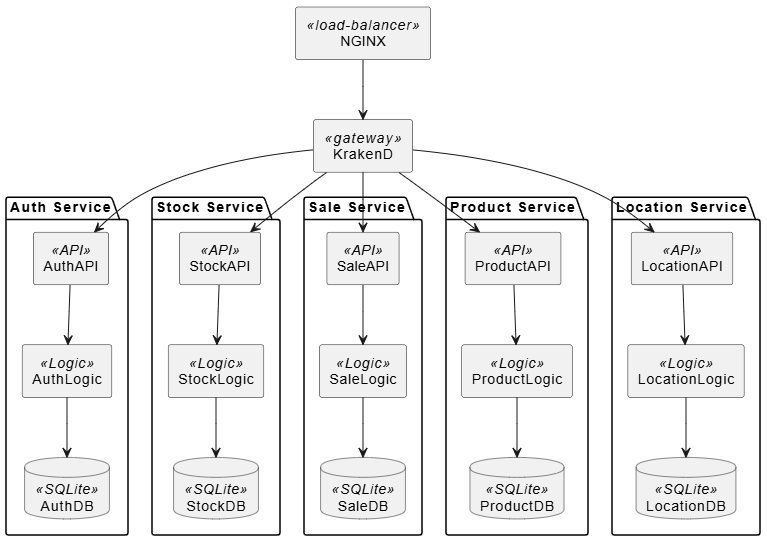

# arc42 Architecture Documentation

## 1. Introduction & Goals

Ce projet implémente une application de caisse distribuée via une architecture à microservices. Chaque service est responsable d’un domaine métier spécifique : authentification, produits, stocks, ventes et emplacements.

### Objectifs qualitatifs principaux :
- **Modularité** : chaque microservice est indépendant.
- **Observabilité** : Prometheus + Grafana pour la surveillance.
- **Extensibilité** : architecture prête pour ajout de services.
- **Sécurité** : accès par JWT via un service d’authentification.

## 2. Constraints

- Utiliser uniquement **Python/Flask** pour les microservices.
- La base de données doit être **SQLite** (locale, sans serveur).
- L’API Gateway doit être **KrakenD**, et le reverse proxy **NGINX**.
- Observabilité obligatoire avec **Prometheus**.
- Tous les services doivent être conteneurisés via **Docker**.

## 3. Context & Scope

### Acteurs externes :
- Utilisateur (vendeur) via une interface Web (ou Postman).

### Interfaces externes :
- KrakenD gère les appels entrants.
- Prometheus collecte les métriques.
- Redis stocke des caches JWT (auth).

## 4. Solution Strategy

- Architecture **microservices**
- Chaque service a 3 couches : API REST, logique métier, accès DB.
- Séparation des responsabilités strictes entre services.
- Utilisation de JWT pour l’authentification.
- KrakenD pour centraliser les points d’accès et appliquer CORS.

## 5. Building Block View

Chaque service suit cette structure :
/service_name
|-- app.py
|-- api.py
|-- repository.py
|-- models.py
|-- database.py
|-- tests/

- `app.py` : point d’entrée du service  
- `api.py` : définit les routes Flask-RESTX  
- `repository.py` : logique métier  
- `models.py` : ORM SQLAlchemy  

## 6. Runtime View

### Scénario : effectuer une vente

1. L'utilisateur s’authentifie via `Auth` (JWT)  
2. L'utilisateur appelle `/api/products` (KrakenD => ProductAPI)  
3. Il appelle `/api/stock/check` (KrakenD => StockAPI)  
4. Il appelle `/api/sale` (KrakenD => SaleAPI)  
5. SaleAPI appelle StockAPI pour déduire le stock  

## 7 Deployment view

Chaque service est déployé dans un conteneur Docker distinct. KrakenD agit comme point d’accès unique. Et le NGINX redistribue puisque c'est un load balancer.

## 8. Crosscutting Concepts

- **Sécurité** : JWT, contrôle d’accès sur les routes  
- **Observabilité** : Prometheus + metrics Flask  
- **CORS** : activé sur KrakenD  
- **CI/CD** : GitHub Actions (lint, test, build, push Docker)  

## 9. Architectural Decisions

| # | Titre | Lien |
| - | - | - |
| 1 | Choix de la plateforme (labo 1) | [ADR 1](docs/ADR/ADR1.md)|
| 2 | Séparation des responsabilités entre présentation, logique et persistance (labo 1) | [ADR 2](docs/ADR/ADR2.md)|
| 3 | Choix d’une architecture modulaire inspirée de DDD (labo 2) | [ADR 3](docs/ADR/ADR3.md) |
| 4 | Conteneurisation avec Docker Compose pour la simulation multi-sites (labo 2) | [ADR 4](docs/ADR/ADR4.md) |
| 5 | Choix de la passerelle API (KrakenD) (labo 5) | [ADR 5](docs/ADR/ADR5.md) |
| 6 | Choix du reverse proxy (NGINX) (labo 4) | [ADR 6](docs/ADR/ADR6.md) |
| 7 | Choix du système de cache (Redis) (labo 4) | [ADR 7](docs/ADR/ADR7.md) |

## 10. Quality Requirements

### Exigences qualité :

- **Performance** : latence < 200ms par appel  
- **Disponibilité** : services tolérants aux erreurs  
- **Modularité** : chaque service remplaçable indépendamment  

## 11. Risks & Technical Debt

- **SQLite** limite l’accès concurrent => migrer vers PostgreSQL si mise en prod  
- **Pas de réplication** entre services (ex: stock et vente peuvent diverger)  
- **Observabilité** simple, sans alerting configuré  

## 12. Glossary

| Terme         | Définition                                           |
|---------------|------------------------------------------------------|
| KrakenD       | API Gateway open-source pour microservices          |
| JWT           | JSON Web Token, identifiant sécurisé de session     |
| Prometheus    | Outil de surveillance open-source pour les métriques |
| NGINX         | Serveur proxy/reverse-proxy HTTP performant         |
| Redis         | Base clé-valeur en mémoire, utilisée pour cache     |
